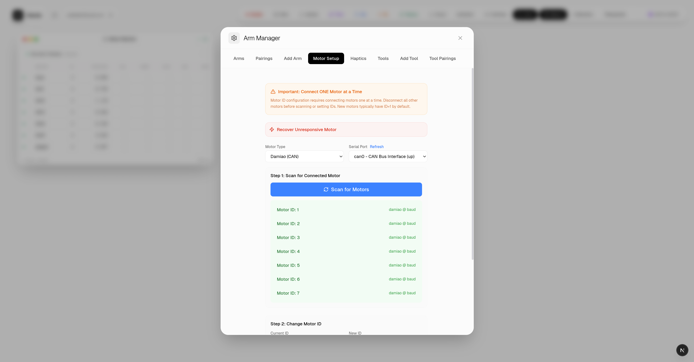
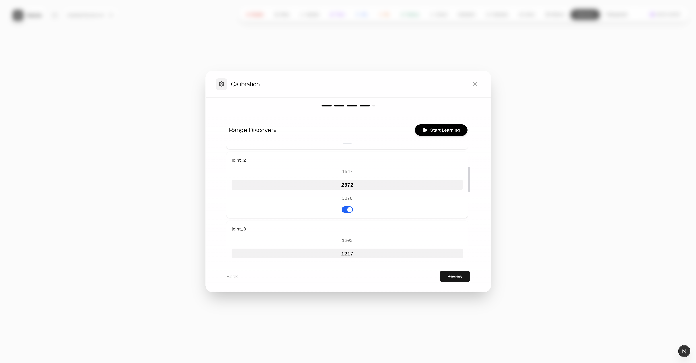
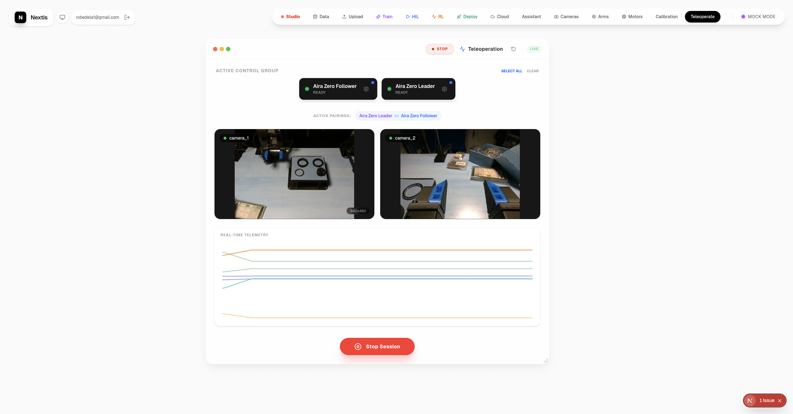
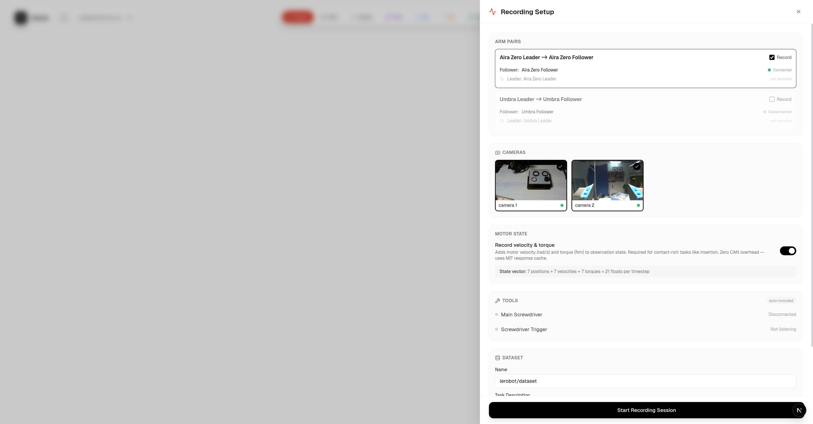
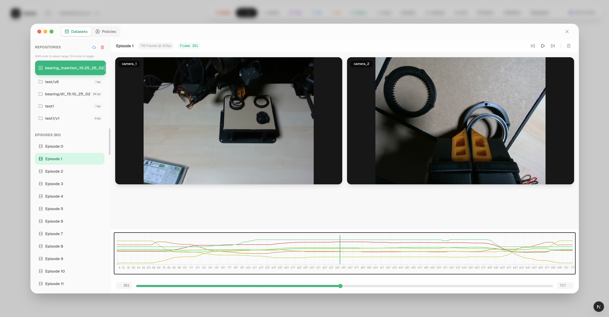
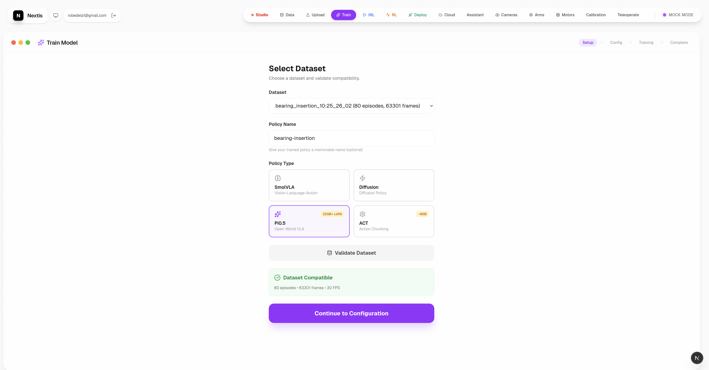
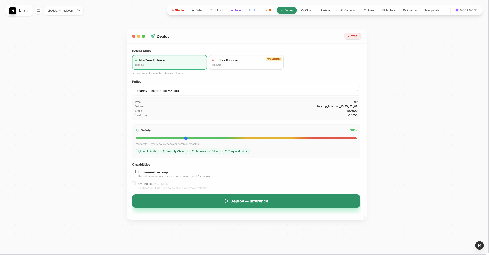

# Nextis Bridge

Hardware control, teleoperation, and training platform for Nextis robotic arms.
Built on [LeRobot](https://github.com/huggingface/lerobot) by Hugging Face.

## What It Does

Nextis Bridge is a web-based workstation for robotic manipulation research. It manages the full workflow from hardware bring-up to trained policy deployment — connect arms, calibrate joints, teleoperate with force feedback, record demonstrations, train policies, and deploy them. No terminal required for day-to-day operation.

## Workflow

### 1. Configure Arms

Scan for motors on CAN or serial buses, assign IDs, and set up arm definitions and pairings.



### 2. Calibrate Joints

Interactive range discovery: move each joint through its range while the system records limits. Saves persistent calibration profiles.



### 3. Teleoperate

60 Hz leader-to-follower control with MIT impedance mode, live multi-camera feeds, and real-time joint telemetry.



### 4. Record Demonstrations

Select which arm pairs and cameras to record. Episodes are saved in LeRobot v3 format (HDF5 + MP4 video).



### 5. Review Data

Browse datasets and episodes with synchronized multi-camera video playback and joint trajectory plots.



### 6. Train a Policy

Choose a policy type (ACT, Diffusion Policy, SmolVLA, or PI0.5), validate your dataset, and configure training — all from the browser.



### 7. Deploy

Select an arm and a trained policy, set safety limits (joint bounds, velocity clamp, torque monitor), and deploy. Optionally enable human-in-the-loop fine-tuning.



## Quick Start

```bash
git clone https://github.com/FLASH-73/Nextis_Bridge.git && cd Nextis_Bridge

# Python environment
conda create -n nextis python=3.11 -y && conda activate nextis
pip install -r requirements.txt
pip install -e lerobot

# CAN bus setup (required for Damiao arms — run once per boot)
sudo ./setup_can.sh

# Start backend
python run_backend.py                      # FastAPI on http://localhost:8000

# Start frontend (separate terminal)
cd frontend && npm install && npm run dev  # Next.js on http://localhost:3000
```

Open `http://localhost:3000` to access the dashboard. Hardware is optional — the dashboard, dataset tools, and training pipeline all work without connected arms.

## Hardware

| Component | Spec |
|-----------|------|
| Follower arms | 2x Damiao AIRA Zero — J8009P + J4340P + J4310, 7-DOF, CAN bus |
| Leader arms | 2x Dynamixel XL330 — USB serial, force feedback via current-position mode |
| Grippers | Damiao J4310 with torque-modulated force feedback |
| Cameras | USB webcams + Intel RealSense supported |
| Compute | Linux workstation, NVIDIA GPU for policy training |

## Architecture

```
app/
├── core/
│   ├── hardware/       # Arm registry, motor control, safety layer
│   ├── teleop/         # 60 Hz control loop, force feedback, recording
│   ├── calibration/    # Joint calibration, homing, profiles
│   ├── cameras/        # Camera lifecycle, MJPEG streaming
│   ├── dataset/        # Episode browsing, dataset merge
│   ├── training/       # Job management, policy presets, log streaming
│   ├── hil/            # Human-in-the-loop intervention capture
│   └── rl/             # SAC policy, Gym environment, reward classifiers
├── routes/             # FastAPI endpoints — one file per domain
└── config/             # YAML-based arm and camera configuration
frontend/               # Next.js + React + TypeScript + Tailwind CSS
lerobot/                # Vendored LeRobot fork
```

## Testing

```bash
python -m pytest tests/ -v --tb=short   # All tests run without hardware
ruff check app/ tests/                  # Lint
```

## Acknowledgements

Nextis Bridge is built on top of [LeRobot](https://github.com/huggingface/lerobot) by Hugging Face (Apache 2.0 license). LeRobot provides the motor drivers, dataset format, robot abstractions, and policy training infrastructure (ACT, Diffusion Policy, SmolVLA, PI0.5) that this platform wraps with a web UI. The vendored fork lives in the `lerobot/` directory with its original license preserved.
